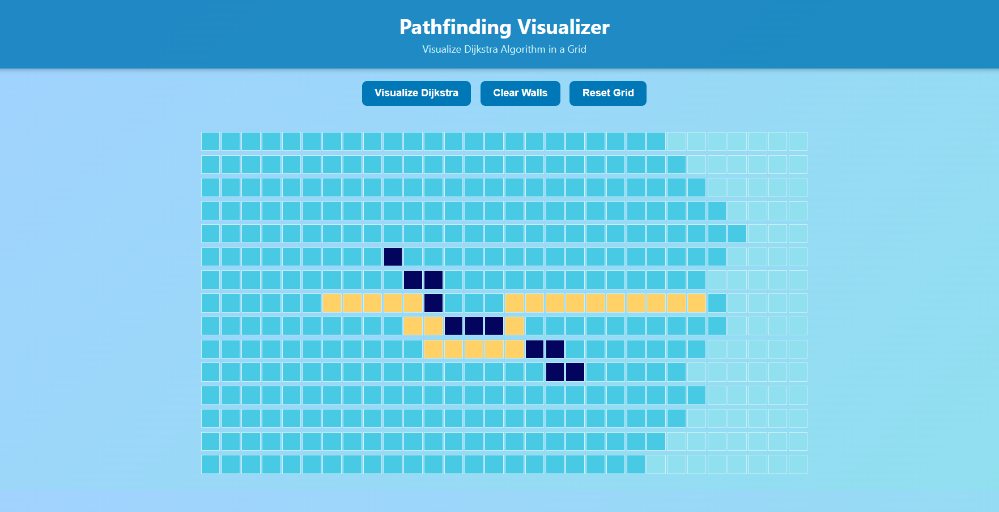

# Dijkstra Pathfinding Visualizer

A simple and intuitive web-based project that demonstrates how Dijkstra’s algorithm finds the shortest path in a grid. The start and end nodes are predefined, and upon execution, the algorithm directly computes and visually displays the shortest route between them.

## 🔧 Features
- Predefined start and end points for consistent visualization.
- Automatically computes and displays the shortest path using Dijkstra’s algorithm.
- Simple and clean user interface.
- Ideal for understanding graph traversal and shortest path concepts.

## 🚀 Technologies Used
- HTML, CSS, JavaScript
- Netlify (for deployment)

## 📷 Screenshot

## 🌐 Live Demo
[Visit on Netlify](https://pathfinding-visualize-dijkstra-algo.netlify.app/)

